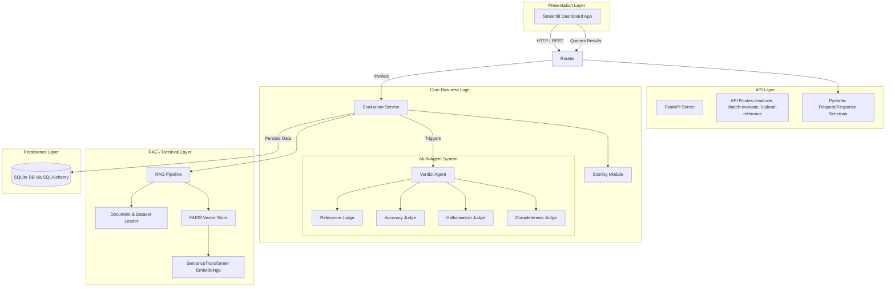
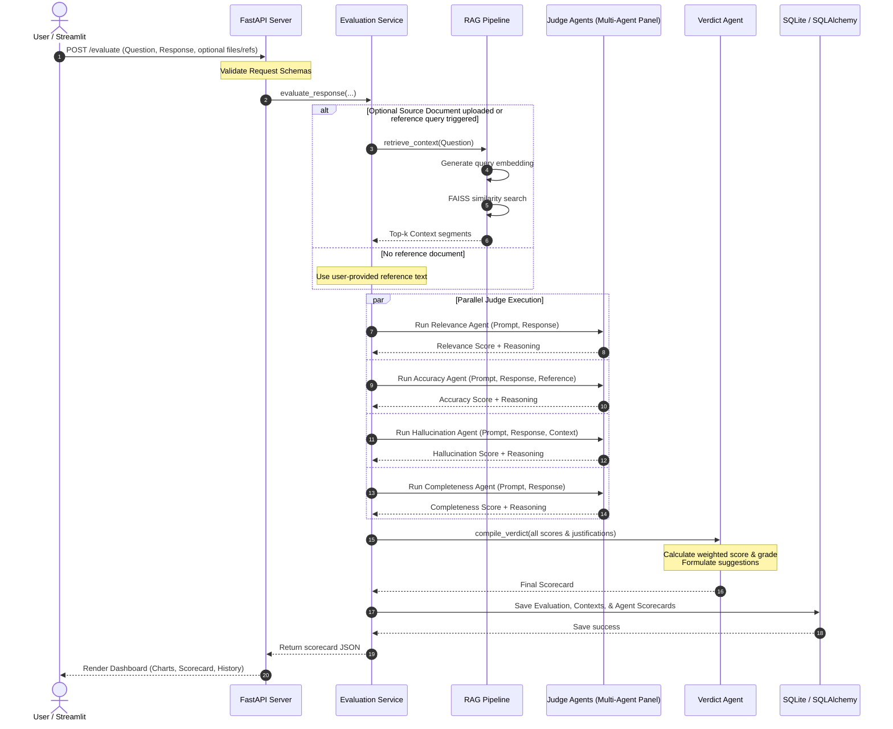
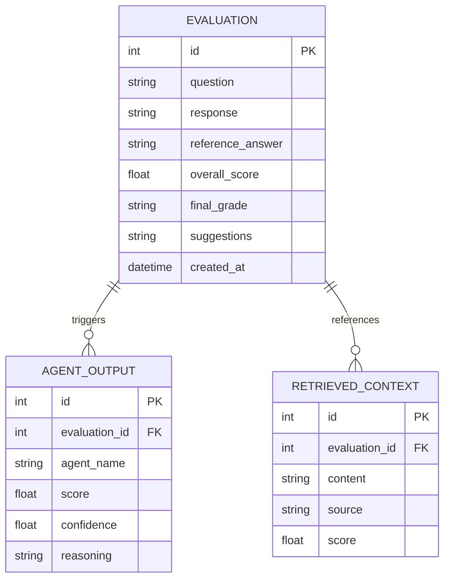
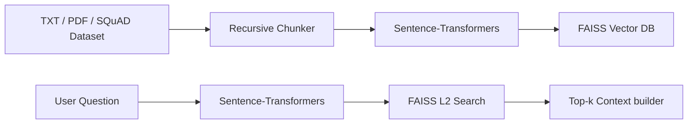

# System Design and Architecture Documentation

This document describes the architectural blueprint, data flows, components, API designs, and pipeline logic of the **AI Response Quality Evaluator Agent**.

---

## 1. System Architecture & Component Diagram

The system is designed following **Clean Architecture** principles to separate core business logic (evaluators, agents, and pipelines) from delivery mechanisms (FastAPI REST API, Streamlit Frontend) and data access layers (SQLite, FAISS Vector Index).

### Component Diagram

---

## 2. Sequence Diagram

This diagram shows the end-to-end execution flow of a single evaluation query.

---

## 3. Database Design

We use SQLite for relational persistence. The schema details are below:

### Table Definitions
1. **`Evaluation`**: Main evaluation execution record.
2. **`AgentOutput`**: Stores the raw score, reasoning text, and confidence calculated by each individual specialized LLM agent.
3. **`RetrievedContext`**: Holds chunks of relevant text extracted from RAG datasets or uploaded files.

---

## 4. Evaluation and Scoring Pipeline

The evaluation system scores responses on a 0-10 scale for multiple dimensions.

### Scoring Dimensions
* **Relevance**: Evaluates if the response is directly addressing the prompt.
* **Accuracy**: Evaluates alignment with the reference ground truth.
* **Groundedness (Faithfulness)**: Evaluates if response claims are fully backed by retrieved context.
* **Completeness**: Evaluates if all elements of the question are answered.

### Scoring Engine Logic
The overall score is a weighted sum of the individual dimensions. The default weights are:
$$\text{Overall Score} = 0.25 \times \text{Relevance} + 0.25 \times \text{Accuracy} + 0.30 \times \text{Groundedness} + 0.20 \times \text{Completeness}$$

### Grades
- **Grade A (Excellent)**: $\ge 9.0$
- **Grade B (Good)**: $\ge 7.5$ and $< 9.0$
- **Grade C (Fair)**: $\ge 5.5$ and $< 7.5$
- **Grade F (Fail)**: $< 5.5$

---

## 5. RAG Pipeline

* **Chunking**: Chunks documents into 500-character segments with a 50-character overlap.
* **Indexing**: Chunks are processed via BAAI or MiniLM embedding models and saved locally in a FAISS index.
* **Retrieval**: At query time, the top 3 (k=3) contexts are fetched to populate the grounding prompt.

---

## 6. API Design

### `GET /health`
Verifies server health and model status.

### `POST /upload-reference`
Allows uploading reference TXT/PDF files or text to insert into the FAISS index.
- **Request (Multipart)**:
  - `file`: Uploaded file (optional)
  - `text`: Raw text (optional)
  - `source_name`: String identifier

### `POST /evaluate`
Executes single response evaluation.
- **Request (JSON / Multipart)**:
  - `question`: Query string
  - `response`: Generated response
  - `reference_answer`: Ground truth (optional)
- **Response**: Full scorecard including scores, individual agent logs, retrieved contexts, and verdict.

### `POST /batch-evaluate`
Accepts a CSV with `question`, `response`, and optional `reference_answer` columns, running evaluations on each row.

### `GET /results`
Retrieves past records from the SQLite database.
