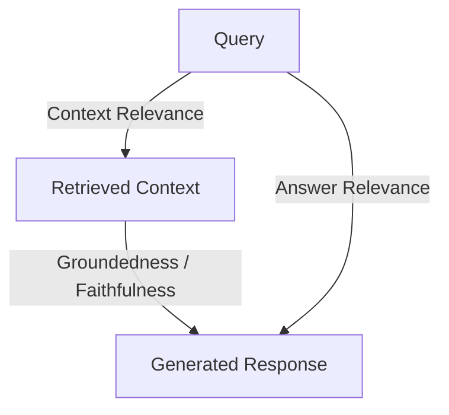

# RAG Evaluation, Hallucination Detection, and Frameworks

Retrieval-Augmented Generation (RAG) combines document retrieval systems with LLMs to generate responses grounded in specific external knowledge bases. Grounding models this way helps reduce hallucinations, but RAG systems introduce complexity: they can fail either because the retrieval step fetched the wrong context, or because the generator step misread the context or ignored it.

This document details RAG metrics, frameworks like RAGAS and TruLens, and vector databases used in evaluations.

---

## 1. The RAG Triad

A standard RAG pipeline can be modeled as three primary nodes: **Query**, **Retrieved Context**, and **Generated Response**. Evaluating a RAG system involves validating the links between these three nodes. This framework is popularized as the **RAG Triad** (utilized by TruLens):

### The Three Pillars of the Triad:
1. **Context Relevance (Query ➔ Context)**: Evaluates whether the retrieved documents are relevant to the user query. If low, the retriever is fetching noise, which can confuse the LLM generator.
2. **Groundedness / Faithfulness (Context ➔ Response)**: Measures if the generated response is strictly derived from the retrieved context. Any statement in the response not supported by the context is a factual hallucination.
3. **Answer Relevance (Query ➔ Response)**: Measures if the final generated response actually answers the user's query, ensuring that formatting, tone, and substance align with the prompt.

---

## 2. Hallucination Detection

Hallucination occurs when an LLM generates statements that are factually false or unsupported by its context/pre-training.

### Classification of Hallucinations:
- **Intrinsic Hallucination**: The model's response directly contradicts the source documents.
- **Extrinsic Hallucination**: The model's response contains details that are not mentioned in the source documents (cannot be verified as true or false purely based on the source context).

### Detection Techniques:
* **NLI (Natural Language Inference)**: Treats the source context as the *premise* and the generated response sentences as *hypotheses*. The system uses an NLI model (e.g., DeBERTa) to calculate whether the response is *entailed*, *neutral*, or *contradictory* to the source context.
* **Self-Consistency Check**: Runs the LLM generator multiple times at temperature > 0. If the outputs differ significantly in factual claims, it indicates low confidence and potential hallucination.
* **LLM-as-a-Judge Fact Checking**: Instructs a separate judge LLM to:
  1. Break the generated response down into individual atomic factual claims.
  2. For each claim, locate supporting sentences in the source context.
  3. Output a percentage score of grounded facts.

---

## 3. RAGAS (Retrieval Augmented Generation Assessment)

RAGAS is an open-source evaluation framework designed to score RAG pipelines without requiring human-annotated ground-truth labels. It uses LLMs under the hood to calculate key metrics:

* **Faithfulness**: Counts the number of claims in the generated response that can be inferred from the retrieved context, divided by the total number of claims. (Range: 0 to 1).
* **Answer Relevance**: Measures the semantic similarity between the original query and generated dummy queries based on the response. High similarity means the response addresses the prompt.
* **Context Recall**: Measures whether the retriever fetched all the information required to answer the question, as verified against a reference answer.
* **Context Precision**: Evaluates if the highly relevant chunks are ranked higher in the retrieved context list.

---

## 4. TruLens

TruLens is an evaluation and tracking library that implements the RAG Triad. It uses **Feedback Functions** to rate and trace LLM applications:

* **Groundedness**: Verified using sentence-level check against retrieved source chunks.
* **Sentiment & Toxicity**: Evaluates response appropriateness, safety, and brand alignment.
* **LLM Provider Cost & Latency**: Traces individual steps to identify bottlenecks in the RAG execution chain.

---

## 5. Embeddings and Vector Databases

RAG relies heavily on converting documents and queries into dense vector representations.

### Embedding Models
* **sentence-transformers**: Libraries that map text to fixed-size vectors (embeddings) in a high-dimensional space where semantic similarity corresponds to vector similarity.
* **all-MiniLM-L6-v2**: A lightweight, highly efficient model mapping text to 384-dimensional vectors. Great for fast CPU-based inference.
* **BAAI/bge-small-en-v1.5**: A top-tier open-source embedding model mapping text to 384 dimensions, trained on massive contrastive text pairs. It offers superior performance on retrieval tasks.

### Vector Databases & Indexes
* **FAISS (Facebook AI Similarity Search)**: A library for efficient similarity search and clustering of dense vectors. It supports L2 (Euclidean) distance and Inner Product (Cosine Similarity) searches. FAISS handles indexing and top-k retrieval on disk or memory locally, making it ideal for self-contained desktop and server installations.
* **Mechanism**:
  1. Text documents are chunked (e.g., using recursive character splitters with overlap).
  2. Embeddings are generated for each chunk.
  3. Embeddings along with text metadata are stored in a FAISS index.
  4. At query time, the query is embedded, and FAISS performs a k-nearest-neighbors (k-NN) search to return the most semantically relevant text chunks.
